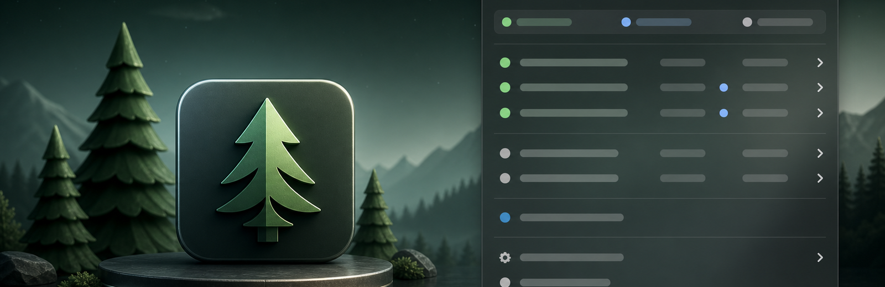
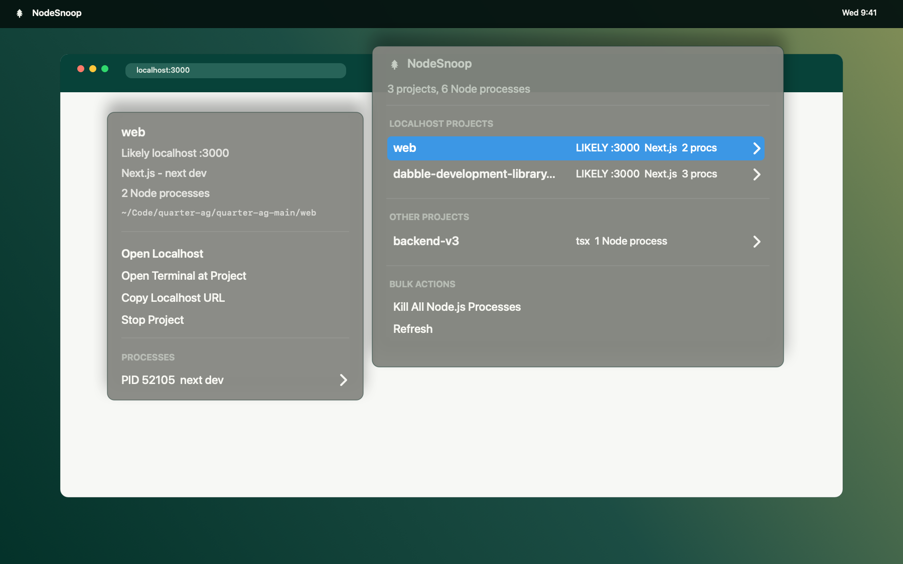

<p align="center">
  
</p>

# NodeSnoop

NodeSnoop is a spruce-tree menu bar app and terminal tool for seeing, opening, and stopping the Node.js projects running on your Mac.

<p align="center">
  
</p>

## What It Does

- Groups related Node.js processes by project instead of showing one noisy PID list.
- Detects localhost apps from live listeners, child listener processes, `--port`, `PORT=`, and likely framework defaults.
- Separates app projects from common development tools such as Claude Code, Codex, TypeScript language servers, ESLint, Prettier, VS Code, and Cursor.
- Opens localhost URLs, opens Terminal at a project folder, copies project paths or process IDs, and stops one project at a time.
- Includes a simple CLI, a keyboard-driven TUI, and a native macOS menu bar app.

## Install

Until the npm package is published, install the current GitHub version:

```sh
npm install -g github:mattrichmo/nodesnoop#main
nodesnoop app install
```

After the package is published to npm:

```sh
npm install -g nodesnoop
nodesnoop app install
```

`nodesnoop app install` builds the native AppKit app from the included Swift source, installs it to `~/Applications/NodeSnoop.app`, and launches it.

## Menu Bar App

```sh
nodesnoop app install
```

The menu bar app uses the spruce icon in the macOS menu bar. The menu is organized into status, localhost projects, other projects, development tools, bulk actions, and application settings.

Project submenus include actions for opening localhost when detected, opening Terminal at the project directory, copying the localhost URL, copying the project path, copying PIDs, stopping the project, and inspecting individual processes.

The app also includes an `Open at Login` toggle. It creates a user LaunchAgent at:

```text
~/Library/LaunchAgents/dev.nodesnoop.menubar.login-item.plist
```

## CLI

```sh
nodesnoop list
nodesnoop list --json
nodesnoop tui
nodesnoop kill all
nodesnoop kill all --force
nodesnoop kill all --dry-run
nodesnoop open <pid>
```

`nodesnoop kill all` sends `SIGTERM` to every detected Node.js process except the `nodesnoop` CLI process itself. Use `--force` to send `SIGKILL`.

`nodesnoop open <pid>` opens Terminal at the process working directory when macOS allows that directory to be read. A running process generally cannot be reattached to a new terminal unless it was started inside a terminal multiplexer such as `tmux` or `screen`, so NodeSnoop opens the closest useful context: the process cwd.

## TUI

```sh
nodesnoop tui
```

Keys:

- `up` / `down`: move selection
- `k`: kill selected process
- `K`: kill all Node.js processes
- `o`: open Terminal at the selected process cwd
- `r`: refresh
- `q`: quit

## Development

```sh
npm install
npm test
npm run app:build
```

The CLI/TUI has no runtime npm dependencies. The macOS app is built locally from Swift source, so the package does not need Electron or prebuilt architecture-specific binaries.
